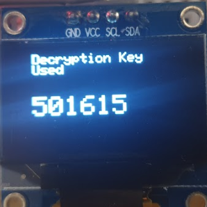

CMP101 Assessment - The Encrypty Thing
======================================
> | Disclaimer: | This is the coursework that was sumitted for an assessment, feel free to be inspired or get in touch with me about the code base. Please do not plaigarise as you'll likely get caught which is not a good look for anyone. |
> |-------------|:--------------------|

> ```
> Author - Joseph Lee
> Date - 27/11/2019
> Project Name - The Encrypty Thing
> ```

> If you have any questions about this project then [contact me](mailto:1903399@uad.ac.uk?subject=[Github]%20-%20The%20Encrypty%20Thing%20Contact) and I would be happy to answer any queries.

Overview
--------

This device was created for the CMP101 end of module assessment. It uses the following components:
* Wemos board 
* OLED 
* RTC 
* Potentiometer
* Button
* LED
* SD card module
* LCD screen


This device is called The Encrypty Thing. This device utilizes XOR encryption to encrypt a message 
from the SD using a key generated using user input potentiometer value and a ranomly generated number. 
If the message is longer then the key, the key is cycled. Each time a message is encrypted or decrypted
a file header will be added into the message stating who encrypted/ decrypted message file and the time
and date this was done using the RTC time.


The Examples directory contains several examles of the input and output of this device.

Operating Principle
-------------------

The basis of this device is to encrypt a message and have the ability to decrypt it again if the correct 
key is provided. XOR encryption was used in this device. Although XOR encryption is not the most secure
form of encryption it has a very intersting history and forms the basis for more advanced forms of encryption. 
It is also commonly seen as a very simple approach to obsure a program's functionality in some malware.

My interest in this form of encryption came from reading a book about activities at Bletchy Park in WW2 and
Tunny Traffic a form of encrypted teleprinter messages used by German High Command utilized the *Vernam Cipher*
which is an XOR based symmetric-key algorithm. Below is a summary of the algorithm:

    plaintext ^ key = ciphertext

    ciphertext ^ key = plaintext

This device implements this as in the below diagram. It uses each character of the key to encrypt a message character
and the key is repeated until the whole message is encrypted.


There are several serious weakness with this form of encyption. Firstly, it is very valnerable to *Known-plaintext Attack*
as the below holds true:

    plaintext ^ ciphertext = key

Repeating keys also make this form of encryption very valnerable to frequency analysis, it is also particulary weak when used
on strings of repeating characters. Below is an example of 8 digit key used on a string which contains repeating characters, the 
repeating pattern is very clear from this:

    {wuszps{wuszps{wuszps{wusz?;zvtr{qrzvtr{qrzvtr{qrzvtr{qrzvt

However, this device was set up the implement the simplest form of this encryption so its weaknesses could be explored. This
device however, is good enough to obsure a message well enough for most simple applications.

The best way to use this form of encryption is to use a key with a length at least as long as the message, as this would remove
any key repetition which if the key is generated in a truly random manner would lead to a theoretically unbreakable message.


Componends
----------

The major components of the system are shown below:


Hardware Connections
--------------------

The following section outlines the connections for this device. The breadboard connection values refer to the hole by their grid
referance.

### Wemos Board

| Wemos Board | Cable Colour | Breadboard |
|:-----------:|:------------:|:----------:|
| `D1/SCL`    | BROWN        | `H22`      |
| `D2/SDA`    | RED          | `H21`      |
| `D5/SCK`    | GREY         | `B10`      |
| `D6/MISO`   | WHITE        | `B12`      |
| `D7/MOSI`   | BLACK        | `B11`      |
| `D8/SS`     | YELLOW       | `J24`      |
| `D4`        | RED          | `J25`      |
| `A0`        | PURPLE       | `E25`      |


### LCD Screen

| LCD Board   | Cable Colour | Breadboard |
|:-----------:|:------------:|:----------:|
| `GND`       | GREY         | `GND Rail` |
| `Vcc` (+5V) | RED          | `+5V Rail` |
| `SDA`       | BLACK        | `J21`      |
| `SCL`       | BROWN        | `J22`      |


### OLED Screen

| OLED Board    | Breadboard |
|:-------------:|:----------:|
| `SDA`         | `J9`       |
| `SCL`         | `J10`      |
| `Vcc` (+3.3V) | `J11`      |
| `GND`         | `J12`      |
| `D7/MOSI`     | `B11`      |


### SD Card Module

| SD Module   | Cable Colour | Breadboard |
|:-----------:|:------------:|:----------:|
| `GND`       | ORANGE       | `A14`      |
| `Vcc` (+5V) | RED          | `A13`      |
| `MISO`      | BROWN        | `A12`      |
| `MOSI`      | BLACK        | `A11`      |
| `SCK`       | YELLOW       | `A10`      |

### Real Time Clock DS3231

| RTC Board     | Breadboard |
|:-------------:|:----------:|
| `32K`         | `B23`      |
| `SQW`         | `B22`      |
| `SCL`         | `B21`      |
| `SDA`         | `B20`      |
| `Vcc` (+3.3V) | `B19`      |
| `GND`         | `B18`      |

### Potentiometer

| Potentiometer          | Breadboard |
|:----------------------:|:----------:|
| `GND` - RH Pin         | `B23`      |
| `Signal` - Mid Pin     | `B22`      |
| `Vcc` (+3.3V) - LH Pin | `B21`      |

### LED

| LED    | Breadboard |
|:------:|:----------:|
| `-Ve`  | `J1`       |
| `+Ve`  | `+5V Rail` | 

### Breadboard Cabing

| Cable Colour  | Function                   |
|:-------------:|:--------------------------:|
| GREY          | I2C Data/ Clock            |
| PURPLE        | +3.3V                      |
| BLACK         | GND                        |
| ORANGE        | +5V                        |
| GREEN         | GPIO Pins Input and Output |
| PINK          | Analog Input               |

Usage Instructions
------------------

Instructions on device use are shown below:

* Ensure you have device conencted to a USB port with serial monitor configred to **112500** baud.
* To encrypt a message have message saved on the SD card as `inMessage.txt`.
* To decrypt a message have the encrypted message saved on the SD card as `encMessage.txt` and the key as `decKey.txt`.
* Insert SD card into SD module.
* Plug in USB and the device should power up.
* It will then carry out its set up and tests, this might take a few seconds. Status LED will also blink 3 times in these tests.
* If all tests and setup passed the device will display welcome message on LCD screen. Shown below:


* User will then be prompted to open serial monitor and enter any key to confirm connection. Message shown below:


* Connection will then be confirmed. Message shown below:


* User will then be prompted to enter the mode require via the serial monitor. `E` for Encrypt and `D` for Decrypt.


### Encrypt

* Encrypt Mode will display on LCD. Message shown below:


* Status LED will be **ON** in Encrypt Mode.
* User is prompted if they want to continue to encrypt `inMessage.txt`. Press `Y` to continue.
* `inMessage.txt` summary will be displayed on serial monitor.
* User is prompted to set potentiometer value and enter `Y` when done. OLED screen example below:


* Encrypted message summary will then be shown on serial monitor.
* Encryption key will be displayed on the OLED, for user to take note of. OLED example below:


* Encrypted message is then written to `encMessage.txt`.
* User is then asked to take note of encryption key and press `Y` when done to return to select mode.


### Decrypt

* Decrypt Mode will display on LCD:


* Status LED will be **OFF** in Decrypt Mode.
* User is prompted if they want to continue to decrypt `encMessage.txt` using `key.txt`. Press `Y` to continue.
* Messgae summary and decrypted message will be printed to the serial monitor.
* Decrypted message `decMessage.txt` is then written to the SD card.
* The decryption key used is displayed on the OLED for user's referance. OLED example shown below:



* User is then asked to press `Y` when done to return to select mode.

Errors
------

There are several errors that the system is design to capture and indicate. This section outlines how these are 
indicated and what might cause them.

### Status LED

The status LED shows the system status. There are 3 main system states it indicates shown in below table:

| LED                  | Stuats                        |
|:--------------------:|:-----------------------------:|
| OFF                  | Decrypt Mode                  |
| ON                   | Encrypt Mode                  |
| 3x Slow Flash        | System Setup                  |
| Continous Fash Flash | System Error. Program on Hold |

### List of Errors That Cause System Error State

Below is a list of the common things that cause a Sytem Error and result in the program being on hold. The error
causing hold should be displayed on serial monitor when it occurs.

* SD card not present.
* SD card test failed.
* RTC test failed.
* SD file write failure.
* SD card removal while device is running.
* `inMessage.txt` not found on SD card.
* `encMessage.txt` already exists on SD card.
* `decMessage.txt` already exists on SD card.
* `decKey.txt` not found on SD card.

Test Mode
---------

The system does have a Test Mode to make repeated testing easier. It could also be considered a 'quick' mode as after a message 
is encrypted the `decKey.txt` file is automatically written to SD card as opossed to the normal mode where user needs to add this 
manually. In Test Mode `encMessage.txt`, `decKey.txt` and `decMessage.txt` are automatically overwritten to allow fast testing. 
Test Mode also prints additional information to the serial monitor to assist with debugging/ unserstanding how the device works.

To activate Test Mode:
* Press Wemos  `Rest Button` and wait until Adafruit screen displays on OLED. Shown below:


* Then press and hold `Test Mode Button` at the center of the breadboard.
* Hold this until the welcome message prints on the LCD. 
* Serial monitor should print confirmation of Test Mode activation in setup messgaes. 
* Test Mode will remain active until the device is restarted.


Examples
--------

In the `Examples` directory provided with this project are several examples that show various inputs and outputs from this device.
The following section provides a quick description of what each example shows. 

### ShortExample

This example is a simple short message, in this case an Eward Lear limerick which has been encrypted and decrypted using this device.
The key is provided in the example.

### HpLongExample

This is an example of a very long mssage, in this case an extract from a book trascript. The key is provided in the example. 

### Repeat

This example has a message with lots of reppeating character, to show that in these cases it can be quite easy to work out the key l
length. Similar to the issue shown ealier in an earlier section `Operating Principle`.

### Convo

This is an example of a message that is a converation between two people who have encrypted and decrypted this message several times 
on different devices. This is where the file headers are useful to understand what has happened when and who did it. 

Code Overview
-------------

### Libraries

The following libraries are used in this project:

* `Streaming.h` - Used to get the C++ style syntax (e.g. << operators).
* `Adafruit_GFX.h` - Used to operate OLED.
* `Adafruit_SSD1306.h` - Used to operate OLED.
* `Wire.h` - Used to operate LCD.
* `LiquidCrystal_I2C.h` - Used to operate LCD.
* `DS3231.h` - Used to operate DS3231 RTC.
* `SPI.h` - Used to communicate with RTC & SD card module.
* `SD.h` - Used for I/O to SD card.

### Interesting Points

#### Custom Lock Char

The custom character used for the lock image on the Encrypt Mode LCD screen. Shown below:


Is stored in the global byte array `LOCK_CHAR`:
```cpp
byte LOCK_CHAR[] = {
  B01110,
  B10001,
  B10001,
  B10001,
  B11111,
  B11111,
  B11111,
  B11111
};
```

#### Custom Lock Char

The custom character used for the unlock image on the Decrypt Mode LCD screen. Shown below:


Is stored in the global byte array `UNLOCK_CHAR`:
```cpp
byte UNLOCK_CHAR[] = {
  B01110,
  B10001,
  B10000,
  B10000,
  B11111,
  B11111,
  B11111,
  B11111
};
```


Functions
---------

### Setup

The `setup` function runs once on startup of the Wemos board, this function handles the setup of all the components and on this
device runs the initial tests on the components to ensure they are operating as expected.

```cpp
// ========= Setup Function ======================
void setup() {
  // Serial Setup
  // ------------
  Serial.begin(115200);
//  while(!Serial){
//    ; // wait for serial port to connect.
//  }
  delay(1000);
  Serial << endl;  
  Serial << "Initializing Systems..." << endl;
  
  
  // OLED Setup
  // ----------
  Serial << "Initializing OLED ..." << endl;

  // Display initial message on OLED
  display.begin(SSD1306_SWITCHCAPVCC, OLED_SCREEN_I2C_ADDRESS);
  display.display(); // Print Adafruit Logo
  delay(1000);
  display.clearDisplay();
  display.setTextSize(1); // - a line is 21 chars in this size
  display.setTextColor(WHITE);
  display.setCursor(1,3);
  display << endl;
  display << endl;
  display << endl;
  display << endl;
  display << " Initializing Screen" << endl;
  display.display();
  delay(2000);
  display.clearDisplay();
  display.display();
  
  Serial << "OLED Setup Complete..." << endl;

  // LCD Setup
  // ---------
  Serial << "Initializing LCD ..." << endl;

  // Display initial message on LCD
  lcd.init();
  lcd.backlight();
  lcd << "Initializing Screen";
  delay(2000);
  lcd.clear();
  lcd.createChar(0, LOCK_CHAR);
  lcd.createChar(1, UNLOCK_CHAR);
  
  Serial << "LCD Setup Complete..." << endl;

  // GPIO
  // ---
  Serial << "Setting up GPIO pins..." << endl;
  
  // LED blink to confirm connection
  pinMode(ENCRYPT_LED, OUTPUT);
  LEDflashTest(ENCRYPT_LED);


  // Read button to set TEST_MODE. (TEST_MODE enabled if HIGH)
  pinMode(TEST_MODE_BUTTON, INPUT);
  int testButtonState = digitalRead(TEST_MODE_BUTTON);
  Serial << "Test mode button: " << testButtonState << endl;
  if(testButtonState == 1){
    Serial << "TEST MODE ENABLED" << endl;
    TEST_MODE = true;
  }
  
  Serial << "GPIO Pin Setup Complete..." << endl;

  // SD Card Setup
  // -------------
  Serial << "Initializing SD Card ..." << endl;

  // Initialise and test SD card
  if(!SD.begin(0)){
    // Error
    Serial << "SD Initialization Failed" << endl;
    while(1){
      LEDErrFlash(ENCRYPT_LED);
      delay(1); // To keep watchdog happy
    }
  } else {
    Serial << "Testing SD Card ..." << endl;
    if(SDcardTest()){
      Serial << "SD Card Test Passed..." << endl;
    } else {
      // Error
      Serial << "SD Card Test Failed" << endl;
      while(1){
        LEDErrFlash(ENCRYPT_LED);
        delay(1); // To keep watchdog happy
      }
    }    
  }

  // RTC
  // ---
  Serial << "Testing RTC..." << endl;

  // Test to confirm RTC is reading data
  if(RTCTest()){
    Serial << "RTC Test Passed..." << endl;
  } else {
    Serial << "RTC Test Failed" << endl;
    while(1){
      // Error
      LEDErrFlash(ENCRYPT_LED);
      delay(1); // To keep watchdog happy
    }
  }
  
  // Setup Finished Messages
  Serial << "System Setup Finished..." << endl;
  delay(2000);

  // Welcome Message
  // ---------------
  LCDPrintWelcome();
  SerialPrintWelcome();
  delay(6000);
  LCDUserPrompt();
}
```

### Loop

The `loop` function contains the main body of the code. This code runs cyclically on the Wemos board. Once it reaches the end it will 
return back to the start. On this device all the user input/ output, encryption, readinng and writing of data are carried out in this 
function. There are detailed comments in this function to aid understanding its functionality.

```cpp
// ========== Loop Function ======================
void loop() {
  // First run, confirm the connection
  // ---------------------------------
  if(!Serial.available() && FIRST_RUN){

    // Wait for user to confirm they have a connection
    while(!Serial.available()){
      Serial << "Please Confirm Connection By Pressing Any Key:" << endl;
      int inByte = Serial.read();
      delay(3000);
    }

     // Flush unsed data from serial RX buffer
     serialRXFlush(); 

     // TEST MODE - Print serial state to help debug
     if(TEST_MODE){
      Serial << endl;
      Serial << "TEST MODE - Serial state: " << Serial.available() << endl;
      Serial << endl;
     }
     
    // Connection Confirmed Message
    Serial << "Serial Connection Confirmed" << endl;
    LCDConnectionConfirmed();
    delay(1000);


    // Set FIRST_RUN to false so this section only runs on startup
    FIRST_RUN = false;
  }

  // Select Mode
  // -----------  
  // Ask user to select mode (encrypt or decrypt)
  LCDSelectMode();
  Serial << "Please select mode. Input 'E' for Encrypt and 'D' for decrypt:" << endl;
  bool isValidMode = false;

  // Take user input via serial and set ENCRYPT_MODE
  while(!isValidMode){
    // Only read when there is data  
    while(Serial.available()){
      char inChar = Serial.read();

      if(inChar == 'E' || inChar == 'e' || inChar == 'D' || inChar == 'd'){
        isValidMode = true;

        if(inChar == 'E' || inChar == 'e'){
          ENCRYPT_MODE = true;
          serialRXFlush();
        } else {
          ENCRYPT_MODE = false;
          serialRXFlush();
        }        
      } else {
        Serial << "Invalid mode entered, Input 'E' for Encrypt and 'D' for decrypt:" << endl;
        serialRXFlush();
      }
    }    
  }

  // TEST MODE - Print serial state to help debug
  if(TEST_MODE){
    Serial << endl;
    Serial << "TEST MODE - Serial state: " << Serial.available() << endl;
    Serial << endl;
  }  
  
  // Set ENCRYPT_LED - (ENCRYPT = ON, DECRYPT = OFF)
  // ---------------
  if(ENCRYPT_MODE){
    digitalWrite(ENCRYPT_LED, 0);
  } else {
    digitalWrite(ENCRYPT_LED, 1);
  }

  // Encrypt Mode Section
  // ====================
  if(ENCRYPT_MODE){

    // Print mode on LCD
    LCDEncryptMode();

    // Prompt user input to confirm
    Serial << "ENCRYPT MODE SELECTED" << endl;
    Serial << "Would you like to encrypt inMessage.txt? Press 'Y' to encrypt:" << endl;
    bool encCont = false;
    String inMessage = "";

    while(!encCont){
      if(Serial.available() > 0){
        char inChar = Serial.read();

        if(inChar == 'Y' || inChar == 'y'){
          encCont = true;
        }         
      }
    }

    // Read in Data From SD Card
    // --------------------------
    // Reads in the data from inMessage.txt
    if(SD.exists("inMessage.txt")){
      File messageFile = SD.open("inMessage.txt");
      while(messageFile.available()){
        inMessage += messageFile.readStringUntil('\n');
        inMessage += '\n';
      }
      messageFile.close();
    } else {
      Serial << "inMessage.txt not found. Please check and restart..." << endl;
      while(1){
        // Error
        LEDErrFlash(ENCRYPT_LED);
        delay(1); // To keep watchdog happy
      }
    } 
    
    // Print inMessage summary to Serial
    // ---------------------------------
    Serial << endl;
    Serial << "Message is " << inMessage.length() << " characters long." << endl;  
    Serial << endl;
    Serial << "************ IN MESSAGE START ************" << endl;  
    Serial << inMessage << endl;
    Serial << "************ IN MESSAGE END **************" << endl;  
    Serial << endl;
    
    // Read in potentiometer value
    // ---------------------------    
    // Print LCD message
    LCDSetPot();

    // Read in value when user confirms
    Serial << "Set potentiometer value, use small screen. Enter 'Y' when done:" << endl;
    bool potSet = false;
    int potValue = 0;

    while(!potSet){
      potValue = analogRead(POT_INPUT);
      display.clearDisplay();
      display.setCursor(0,0);
      display << "Potentiometer Value:" << endl;
      display.setTextSize(3);
      display << endl;
      display << potValue << endl;
      display.setTextSize(1);
      display.display();

      if(Serial.available() > 0){
        char inChar = Serial.read();

        if(inChar == 'Y' || inChar == 'y'){
          potSet = true;
        }
      }      
      delay(1); // To keep watchdog happy;
    }

    // Generate Encryption Key
    // -----------------------
    // Takes in the potentiometer value to use in key generation
    int encKey = generateEncKey(potValue);

    // TEST MODE - Display the potentiometer value and encryption key to help
    // debugging.
    if(TEST_MODE){
      // TEST display Pot value set
      Serial << endl;
      Serial << "Potentiometer Value Selected: " << potValue << endl;
      Serial << "Enc Key is: " << encKey << endl;
      Serial << endl;
    }

    // Display EncKey on Small OLED
    // -----------------------------
    // Displays the generated encryption key on OLED so user can make note of it
    display.clearDisplay();
    display.setCursor(0,0);
    display << "  Message Encryption" << endl;
    display << "  Key" << endl;    
    display.setTextSize(2);
    display << endl;
    display << " " << encKey << endl;
    display.setTextSize(1);
    display.display();

    // Add Encryption Header to inMessage
    // ----------------------------------
    String fullInMessage = fileHeader(ENCRYPT_MODE) + inMessage;
    
    // Encrypt Message
    // ---------------
    // Using encryption key and XOR encrytion to encrypt the message
    String EncMessage = encryptXOR(fullInMessage, encKey);

    // Print Encrypted Message Summary Serial
    // --------------------------------------
    Serial << endl;
    Serial << "************ ENCRYPTED MESSAGE START ************" << endl;  
    Serial << EncMessage << endl;
    Serial << "************ ENCRYPTED MESSAGE END **************" << endl; 
    Serial << endl;

    // Write Encrypted Message to SD Card
    // ----------------------------------    
    File encMessageFile;

    // TEST MODE - If there is existing encMessage.txt remove it
    if(TEST_MODE){
      if(SD.exists("encMessage.txt")){
        Serial << "TEST MODE - removing exisitng encMessage.txt" << endl;
        SD.remove("encMessage.txt");   
        Serial << endl; 
      }
    }

    // Confirm if the encMessage.txt file exists
    if(SD.exists("encMessage.txt")){
      Serial << "encMessage.txt already exists program on hold..." << endl;
      while(1){
        // Error
        LEDErrFlash(ENCRYPT_LED);
        delay(1); // To keep watchdog happy
      }     
    } else {
        // If there is no encMessage.txt file make a file and write data to it
        encMessageFile = SD.open("encMessage.txt", FILE_WRITE);
        
        for(int i=0; i < EncMessage.length(); i++){
          encMessageFile.print(EncMessage.charAt(i));
        }

        encMessageFile.close();

        // Confirm the file has actually been written to SD card
        if(SD.exists("encMessage.txt")){
          Serial << "Encrypted file encMessage.txt written successfully..." << endl;
        } else {
            // Error
            Serial << "File write error. Program on hold." << endl;
            while(1){
              LEDErrFlash(ENCRYPT_LED);
              delay(1); // To keep watchdog happy
            }
        }
    }

    // TEST MODE - Write encryption key to decKey.txt to speed up testing
    // -------------------------------------------------------------------
    if(TEST_MODE){
      Serial << endl;
      Serial << "TEST MODE - Overwritting existing decKey.txt..." << endl;

      // If there is already a decKey.txt file overwrite it
      if(SD.exists("decKey.txt")){        
        SD.remove("decKey.txt");     
        Serial << "TEST MODE - Deleted existing decKey.txt..." << endl;   
      }

      // Write encryption key to file
      File decKeyFile = SD.open("decKey.txt", FILE_WRITE);

      String encKeyStr = String(encKey);
      
      for(int i=0; i < encKeyStr.length(); i++){
          decKeyFile.print(encKeyStr.charAt(i));
      }

      decKeyFile.close();

      // Confirm the file was actually written to SD card
      if(SD.exists("decKey.txt")){
        Serial << "TEST MODE - decKey.txt created sucessfully..." << endl;
        Serial << endl;
      } else {
        // Error
        Serial << "TEST MODE - Failed to create decKey.txt. Program on hold..." << endl;        
        while(1){
          LEDErrFlash(ENCRYPT_LED);
          delay(1); // To keep watchdog happy
        }
      }      
    }

    // Wait until user is done then clear screen
    // -----------------------------------------
    Serial << "Encryption DONE. Please take note of encryption key from small screen" << endl;
    Serial << "Press 'Y' when done." << endl;
    Serial << "NOTE: KEY IS LOST ONCE 'Y' IS PRESSED. SO BE CAREFUL!" << endl;
    bool encFinished = false;
    while(!encFinished){
      if(Serial.available() > 0){
        char inChar = Serial.read();

        if(inChar == 'Y' || inChar == 'y'){
          
          // Clear all encryption key data
          encFinished = true;
          EncMessage = "";
          encKey = 0;
          Serial << "encKey and EncMessage DELETED!" << endl;
          Serial << "Restarting Program..." << endl;
          Serial << endl;

          // Clear OLED display
          display.clearDisplay();
          display.display();
        }         
      }
    }
    // End Of Encrypt Mode Section
    // ===========================   
  } else { 
    // Decrypt Mode Section
    // ====================

    // Print Mode to LCD & Serial     
    // --------------------------
    LCDDecryptMode();
    Serial << "DECRYPT MODE SELECTED" << endl;

    // Prompt User to Confirm
    // ----------------------
    Serial << "Would you like to decrypt encMessage.txt? Press 'Y' to decrypt:" << endl;
    bool decCont = false;
    String inEncMessage = "";
    String decMessage = "";

    while(!decCont){
      if(Serial.available() > 0){
        char inChar = Serial.read();

        if(inChar == 'Y' || inChar == 'y'){
          decCont = true;
        }         
      }
    }

    // Read in encrypted message from SD
    // ---------------------------------
    // Check if encMessage.txt exists
    if(SD.exists("encMessage.txt")){
      // Read in encMessage.txt data
      File encInFile = SD.open("encMessage.txt");

      while(encInFile.available()){
        inEncMessage += encInFile.readStringUntil('\n');
        inEncMessage += '\n';
      }      
    } else {
      // Error
      Serial << "encMessage.txt not found. Program on hold.." << endl;
      while(1){
        LEDErrFlash(ENCRYPT_LED);
        delay(1); // To keep watchdog happy
      }
    }

    // Print encMessage Summary to Serial
    // ----------------------------------
    Serial << endl;
    Serial << "************ IN ENCRYPTED MESSAGE START ************" << endl; 
    Serial << inEncMessage << endl;
    Serial << "************ IN ENCRYPTED MESSAGE END **************" << endl; 
    Serial << endl;
    
    // Read in Decrypt Key From SD Card
    // --------------------------------
    String keyReadIn = "";
    int decKey = 0;

    // Check if decKey.txt exists
    if(SD.exists("decKey.txt")){
      // Read in decKey.txt data
      File encKeyFile = SD.open("decKey.txt");

      while(encKeyFile.available()){
        keyReadIn += encKeyFile.readStringUntil('\n');
      }   

      decKey = keyReadIn.toInt();
    } else {
      // Error
      Serial << "decKey.txt not found. Program on hold.." << endl;
      while(1){
        LEDErrFlash(ENCRYPT_LED);
        delay(1); // To keep watchdog happy
      }
    }

    // TEST MODE - Print decrypt key used to serial to help debugging
    if(TEST_MODE){
      Serial << endl;
      Serial << "TEST MODE - Decrypt key used: " << decKey << endl;
      Serial << endl;
    }
    
    // Display Decrypt Key Used On OLED
    // --------------------------------
    display.clearDisplay();
    display.setCursor(0,0);
    display << "  Decryption Key" << endl;
    display << "  Used" << endl;    
    display.setTextSize(2);
    display << endl;
    display << " " << decKey << endl;
    display.setTextSize(1);
    display.display();

    // Decrypt Message
    // ----------------
    decMessage = encryptXOR(inEncMessage, decKey);

    // Print Decrypted Message Summary to Serial
    // -----------------------------------------
    Serial << endl;
    Serial << "************ DECRYPTED MESSAGE START ************" << endl; 
    Serial << decMessage << endl;
    Serial << "************ DECRYPTED MESSAGE END **************" << endl;
    Serial << endl;

    // TEST MODE - If there is an existing decMessage delete it
    if(TEST_MODE){
      Serial << endl;
      if(SD.exists("decMessage.txt")){        
        SD.remove("decMessage.txt");     
        Serial << "TEST MODE - Deleted existing decMessage.txt..." << endl;   
      }
      Serial << endl;
    }
    
    // Write Decrypted Message to SD Card
    // ----------------------------------
    File decMessageFile;

    // Check if decMessage already exists
    if(SD.exists("decMessage.txt")){
      // Error
      Serial << "decMessage.txt already exists program on hold..." << endl;
      while(1){
        LEDErrFlash(ENCRYPT_LED);
        delay(1); // To keep watchdog happy
      }     
    } else {
        // Write Decrypted Message to SD Card
        decMessageFile = SD.open("decMessage.txt", FILE_WRITE);

        // Add File Header
        decMessageFile.print(fileHeader(ENCRYPT_MODE));
        
        for(int i=0; i < decMessage.length(); i++){
          decMessageFile.print(decMessage.charAt(i));
        }

        decMessageFile.close();

        // Confirm that file has actually been written to SD card
        if(SD.exists("decMessage.txt")){
          Serial << "Decrypted file decMessage.txt written successfully..." << endl;
        } else {
          // Error
            Serial << "File write error. Program on hold." << endl;
            while(1){
              LEDErrFlash(ENCRYPT_LED);
              delay(1); // To keep watchdog happy
            }
          }    
        }

    // Wait for confirmation that user is done
    // ---------------------------------------
    Serial << "Decryption DONE. Press 'Y' when done" << endl;
    bool decFinished = false;
    while(!decFinished){
      if(Serial.available() > 0){
        char inChar = Serial.read();

        if(inChar == 'Y' || inChar == 'y'){
          // Clear all decrypt data
          decFinished = true;
          decMessage = "";
          decKey = 0;
          Serial << "decKey and decMessage DELETED!" << endl;
          Serial << "Restarting Program..." << endl;

          // Clear OLED
          display.clearDisplay();
          display.display();
        }         
      }
    } 
    
    // End Of Decrypt Mode Section
    // ===========================      
  }

   
  delay(5000); // Restart Delay  
}
```

### Additional Functions

#### SDCardTest()

The `SDCardTest` function returns a `bool`, `true` = test passed, `false` = test failed. It conducts a simple test 
of SD card by writting a `test.txt` to the card and removing.

```cpp
bool SDcardTest(){
  bool testResult = false;
   SD.begin(0);
  // Check for test.txt file
  if(SD.exists("test.txt")){
    SD.remove("test.txt");
    testResult = true;
    // If it can be read, remove it. TEST PASSED
  } else {
  File testFile = SD.open("test.txt", FILE_WRITE);
  testFile.close();
  if(SD.exists("test.txt")){
    SD.remove("test.txt");
    testResult = true;
    // If not make a new test.txt and remove. TEST PASSED
  } else {
    // TEST FAILED
    testResult = false;
  }    
  }  
}
```

#### LEDFlashTest(int LEDpin)

The `LEDFLashTest` function simply flases the LED connected to DO pin `LEDpin`. It will flash the LED 3 times
slowly. This function is used to confirm the operation of the Status LED on system startup.

```cpp
void LEDflashTest(int LEDpin){
  int flashDelay = 900;
  
  digitalWrite(ENCRYPT_LED, 0);
  delay(flashDelay);
  digitalWrite(ENCRYPT_LED, 1);
  delay(flashDelay);
  digitalWrite(ENCRYPT_LED, 0);
  delay(flashDelay);
  digitalWrite(ENCRYPT_LED, 1); 
  delay(flashDelay); 
  digitalWrite(ENCRYPT_LED, 0);
  delay(flashDelay);
  digitalWrite(ENCRYPT_LED, 1);  
}
```

#### LEDErrFlash(int LEDpin)

The `LEDErrFlash` function flashes the LED connected to DO pin `LEDpin`quickly. This is used to conitunually flash the status LED
rapidly when the system enters the System Error state and the program is on hold in an infilite loop to suspend further exectution 
of the code.

```cpp

// Fast LED flash to indicate a fault in the system
void LEDErrFlash(int LEDpin){
  int flashDelay = 100;
  
  digitalWrite(ENCRYPT_LED, 0);
  delay(flashDelay);
  digitalWrite(ENCRYPT_LED, 1);
  delay(flashDelay);
}
```

#### LCDPrintWelcome()

The `LCDPrintWelcome` function prints the welcome message to the LCD. Shown below:


```cpp
void LCDPrintWelcome(){
  lcd.clear();
  lcd << "********************";
  lcd.setCursor(0,1);
  lcd << "*  Welcome to the  *";
  lcd.setCursor(0,2);
  lcd << "*  Encrypty Thing  *";
  lcd.setCursor(0,3);
  lcd << "********************";
}
```

#### LCDUserPrompt()

The `LCDUserPromt` function prints a message to the user to prompt them to open the serial monitor
to allow them to continue the program. Shown below:


```cpp
void LCDUserPrompt(){
  lcd.clear();
  lcd << "~~~~~~~~~~~~~~~~~~~~";
  lcd.setCursor(0,1);
  lcd << " Please Open Serial";
  lcd.setCursor(0,2);
  lcd << "Monitor To Continue";
  lcd.setCursor(0,3);
  lcd << "~~~~~~~~~~~~~~~~~~~~";
}
```

#### LCDConnectionConfirmed()

The `LCDConnectionConfirmed` function prints the message confirming the serial connection is confirmed
by the user inputting a valid command. Shown below:


```cpp
void LCDConnectionConfirmed(){
  lcd.clear();
  lcd << "~~~~~~~~~~~~~~~~~~~~";
  lcd.setCursor(0,1);
  lcd << "  Serial Connection ";
  lcd.setCursor(0,2);
  lcd << "      Confirmed     ";
  lcd.setCursor(0,3);
  lcd << "~~~~~~~~~~~~~~~~~~~~";
}
```

#### LCDSelectMode()

The `LCDSelectMode` function prints the select mode message to the LCD. Shown below:


```cpp
void LCDSelectMode(){
  lcd.clear();
  lcd << "~~~~~~~~~~~~~~~~~~~~";
  lcd.setCursor(0,1);
  lcd << "    Select Mode     ";
  lcd.setCursor(0,2);
  lcd << " Encrypt or Decrypt ";
  lcd.setCursor(0,3);
  lcd << "~~~~~~~~~~~~~~~~~~~~";
}
```

#### LCDSetPot()

The `LCDSetPot` function prints the set potentiometer message to the LCD. Shown below:


```cpp
void LCDSetPot(){
  lcd.clear();
  lcd << "~~~~~~~~~~~~~~~~~~~~";
  lcd.setCursor(0,1);
  lcd <<"  Set Potentiometer  ";
  lcd.setCursor(0,2);
  lcd << "  Use Small Screen  ";
  lcd.setCursor(0,3);
  lcd << "~~~~~~~~~~~~~~~~~~~~";
}
```

#### LCDEncryptMode()

The `LCDEncryptMode` function prints the set Encrypt Mode message to the LCD. Shown below:


```cpp
void LCDEncryptMode(){
  lcd.clear();
  lcd << "********************";
  lcd.setCursor(0,1);
  lcd << "*   Encrypt Mode   *";
  lcd.setCursor(0,2);
  lcd << "* ";

  // Print Line of LOCK_CHAR
  for(int i=0; i < 16; i++){
    lcd.write(0);
  }

  lcd << " *";
  lcd.setCursor(0,3);
  lcd << "********************";
}
```

#### LCDDecryptMode()

The `LCDDecryptMode` function prints the set Decrypt Mode message to the LCD. Shown below:


```cpp
void LCDDecryptMode(){
  lcd.clear();
  lcd << "********************";
  lcd.setCursor(0,1);
  lcd << "*   Decrypt Mode   *";
  lcd.setCursor(0,2);
  lcd << "* ";

  // Print Line of UNLOCK_CHAR
  for(int i=0; i < 16; i++){
    lcd.write(1);
  }

  lcd << " *";
  lcd.setCursor(0,3);
  lcd << "********************";
}
```

#### SerialPrintWelcome()

The `SerialPrintWelcome` prints a simple welcome message to the serial monitor incase the user
has the monitor open on system startup.

```cpp
void SerialPrintWelcome(){
  Serial << "********************" << endl;
  Serial << "*  Welcome to the  *" << endl;
  Serial << "*  Encrypty Thing  *" << endl;
  Serial << "********************" << endl;  
}
```

#### serialRXFlush()

The `serialRXFlush` function is used to clear any unused data that may remain in the RX buffer 
if it is not removed using `Serial.read()` this can cause some issue later in code if the buffer 
is not cleared. 

```cpp
// Clears the RX Serial Buffer
void serialRXFlush(){
  while(Serial.available() > 0){
    int inByte = Serial.read();
    if(TEST_MODE){
      Serial << "TEST MODE - Clear serial RX buffer char" << endl;
    }    
  }
} 
```

#### fileHeader(bool isEncryptMode)

The `fileHeader` function returns the file header `String` to be added to message file with user,
time and date. It will set the message content to refer to encrypting or decrypting the message 
based on `isEncryptMode`. 

```cpp
String fileHeader(bool isEncryptMode){
  // Get the date and time from RTC
  bool Flag24Hr = true;
  bool FlagAmPm;
  bool Century;
  int timeHour = rtc.getHour(Flag24Hr, FlagAmPm);
  int timeMin = rtc.getMinute();
  int timeSec = rtc.getSecond();
  int dateDay = rtc.getDate();
  int dateMonth = rtc.getMonth(Century);
  int dateYear = rtc.getYear();

  String TestUser = "Joseph Lee"; // Hard coded user for each device
  String userString = "";

  // Set depending on ENCRYPT_MODE
  if(isEncryptMode){
    userString = "            Encrypted by " + TestUser;
  } else {
    userString = "            Decrypted by " + TestUser;
  }

  // Concatenate DateString
  String DateString = "            At " + String(timeHour) + ":" + String(timeMin) + ":" +
    String(timeSec) + " on " + String(dateDay) + "/" + String(dateMonth) + "/" + String(dateYear);
  String starLine = "****************************************************\n";
  String headMessage = "";

  // Set depending on ENCRYPT_MODE
  if(isEncryptMode){
    headMessage = "This File Was Encrypted Using The Encrypty Thing\n";
  } else {
    headMessage = "This File Was Decrypted Using The Encrypty Thing\n";
  }

  // Concatenate Full Header String
  String fullHeader = starLine + headMessage + userString + "\n" + DateString + "\n" + starLine +"\n\n";
    
  return fullHeader;         
}
```

#### generateEncKey(int value)

The `generateEncKey` is used to return an encryption key used to encrypt the message. It takes in `value` 
which on this device is the potentiometer value. 

```cpp
int generateEncKey(int value){

  // Generate a random number 0 - 9999
  int key = random(0, 10000);

  // Multiply by the value, in this device potentiometer value
  key *= value;
  
  return key;
}
```

#### encryptXOR(String message, int key)

The `encryptXOR` function encrypts the `message` using `key` and returns the encrypted message as a `String`. This
function is used to both encrypt and decrypt the message as involed the same operation.

```cpp
String encryptXOR(String message, int key){

  // Get key length
  int keyLength = String(key).length();

  // Make Char array for key digits
  char keySplit[keyLength];

  // Split key into digits and store in keySplit
  sprintf(keySplit, "%i", key); 

  // Blank encMessage variable to store message
  String encMessage = "";

  // XOR each char in string with a digit in the key
  // Key split index will loop through the key index 0 - keyLength
  for(int i=0; i < message.length(); i++){
    char encChar = message.charAt(i) ^ keySplit[i % keyLength];
    
    // Append encrypted char to encMessage
    encMessage += encChar;
  }

  return encMessage;
}
```

#### RTCTest()

The `RTCTest` function returns a `bool`, `true` = test passed, `false` = test failed. It attempts
to read the time minute value and confirm it is a realistic value. It should only be between 0 and 60.
If the RTC is not powered or connected this value will be 165.

```cpp
bool RTCTest(){
  bool testPassed = false; // Default is TEST FAILURE
  int rtcData = rtc.getMinute();

  // TEST MODE - Print RTC minute value to serial to help with debugging
  if(TEST_MODE){
    Serial << "TEST MODE - Test RTC Data: " << rtcData << endl;
  }
  
  if(rtcData >= 0 && rtcData <=60){
    testPassed = true;
    // Is a realistic value. TEST PASSED
  }  
  return testPassed;
}
```

